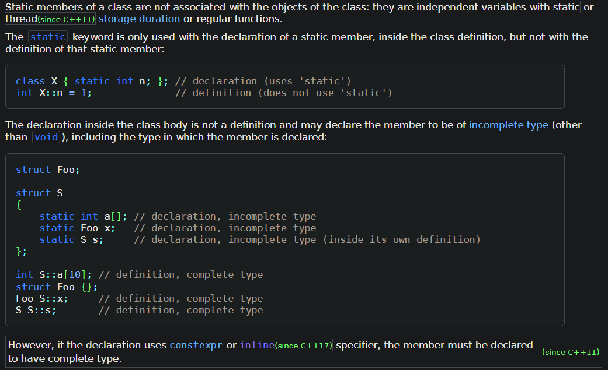
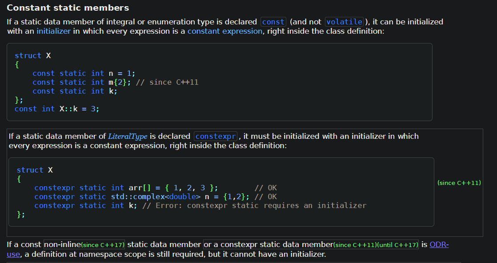
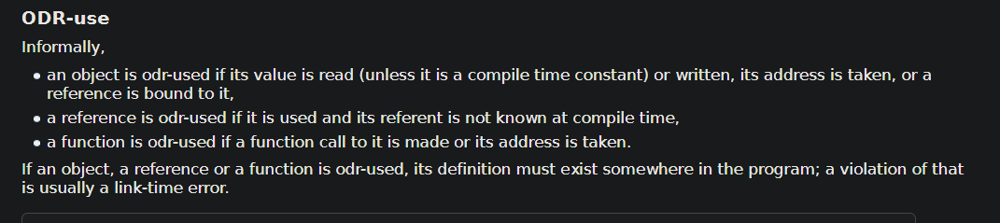

### 打印导致的崩溃
&emsp;&emsp;在使用传统非流式打印时，有可能会遇到一个问题，就是打印格式与实际传入参数不匹配，我们认为大多数情况下这个应该不会导致明显错误，但是仍然有概率碰到由这个导致的问题。我们要明确一点就是，格式化打印本质是通过地址来索引的，每个传入的格式都有它自己的长度，一旦和参数的总长度不匹配就容易发生错误，运气好的话可能只是打印出来的数据看起来有点奇怪，不过更多的情况应该是踩到了不该踩的地址导致程序崩溃。比如你传进了一个只有8个字节长度的数据作为参数，但是格式解析后实际读取了12个字节长，这就很明显有问题了。解决这个也很简单，就是开启格式化打印的warn检测并且使用另外一个编译宏将这个warn视为err即可。

### 常量折叠导致的崩溃
&emsp;&emsp;重构时写完代码准备测试的时候发现编译能过但是一跑都崩，看了下coredump，说是崩在了导航那边的某个构造函数中，但是修改是在我这边的，所以很奇怪，没法通过coredump找出问题具体发生点。遂尝试加log，但是一条log都不会打印出来，原因是压根就没走到有问题的代码，很迷惑，当时只能尝试在不同的地方加return来测试。试了好多次之后发现在一个fwrite之前return就能正常工作，fwrite本身是没问题的，问题发生在被写入的变量上。下面是原代码和我重构后的代码对比示例
```c++
// 原代码
#define MAGIC_NUM 0xFFDDEE

void func() {
    ...
    int magic_num = MAGIC_NUM;
    fwrite(&magic_num, sizeof(int), 1, fd);
    ...
}
```
```c++
// 重构后

class Test{
    ...
    static constexpr int kMagicNum = 0xFFDDEE;
    void func();
};

void Test::func() {
    ...
    // return ;  add return here will be ok
    fwrite(&kMagicNum, sizeof(int), 1, fd);
    ...
}
```
&emsp;&emsp;区别就是把宏提取成了静态成员变量。乍一看没问题，编译也能过。为什么一跑就崩？甚至代码都没运行就崩了？为什么加了return就正常？首先要认识一下静态成员变量的一些特性。https://en.cppreference.com/w/cpp/language/static


&emsp;&emsp;最下面一行写着，如果被constexpr修饰的静态成员变量是ODR-use的，定义仍是被需要的，但是可以不在定义时初始化。问题就转义到了什么是ODR-use。https://en.cppreference.com/w/cpp/language/definition#ODR-use

&emsp;&emsp;简单来说，就是如果只用到了变量的值，就是非ODR-use，否则就是ODR-use，编译器会通过一个变量是否是ODR-use来判断是否要常量折叠，简言之就是要不要优化掉。
&emsp;&emsp;所以问题就明朗了，编译能过是因为代码编出来是so，地址不需要提前确定，所以只编译没问题。一跑就崩是因为初始化这个so的时候这个地址分配不正确，因为没有对应地址，所以应该是这块出的问题，也就是为什么没运行对应代码就崩溃。加了return就正常我猜是因为在函数中直接return下面的内容就被忽略了，直接优化没了，自然就不会有问题。
```c++
// 重构后，正确写法

class Test{
    ...
    static constexpr int kMagicNum = 0xFFDDEE;
    void func();
};
int Test::kMagicNum；

void Test::func() {
    ...
    fwrite(&kMagicNum, sizeof(int), 1, fd);
    ...
}
```

### 关于一个文件是否是可执行文件
&emsp;&emsp;随便写一个1.cc，然后g++ 1.cc编译出来一个a.out，是一个标准的可执行文件。使用g++ 1.cc -shared -fPIC编译得到a.out，是一个so。那么如何在名字一样的情况下区分哪个是可执行文件哪个是so呢？
&emsp;&emsp;先尝试使用file查看，可以看到略有区别但是区别不大，这里其实能看出来是否是可执行文件，但是我们先看file给出的文件类型，两者都是ELF 64-bit LSB shared object，这个是没法区分的。
```bash
file a.out (可执行文件)
> a.out: ELF 64-bit LSB shared object, x86-64, version 1 (SYSV), dynamically linked, interpreter /lib64/ld-linux-x86-64.so.2, BuildID[sha1]=2566378db476eec5be3bf71c54e10d514241ee7e, for GNU/Linux 3.2.0, not stripped

file a.out (so文件)
> a.out: ELF 64-bit LSB shared object, x86-64, version 1 (SYSV), dynamically linked, BuildID[sha1]=9f1af657ab21637aa5318abfa1f1e5f3ad4cfc76, not stripped
```
&emsp;&emsp;然后尝试使用readelf，可以看到在Type这块两者也是一样的，所以在ELF的角度来说两个文件是一个类型。
```bash
readelf -h a.out (可执行文件)
> ELF Header:
  Magic:   7f 45 4c 46 02 01 01 00 00 00 00 00 00 00 00 00
  Class:                             ELF64
  Data:                              2's complement, little endian
  Version:                           1 (current)
  OS/ABI:                            UNIX - System V
  ABI Version:                       0
  Type:                              DYN (Shared object file)
  Machine:                           Advanced Micro Devices X86-64
  Version:                           0x1
  Entry point address:               0x10c0
  Start of program headers:          64 (bytes into file)
  Start of section headers:          15208 (bytes into file)
  Flags:                             0x0
  Size of this header:               64 (bytes)
  Size of program headers:           56 (bytes)
  Number of program headers:         13
  Size of section headers:           64 (bytes)
  Number of section headers:         31
  Section header string table index: 30


readelf -h a.out (so文件)
> ELF Header:
  Magic:   7f 45 4c 46 02 01 01 00 00 00 00 00 00 00 00 00
  Class:                             ELF64
  Data:                              2's complement, little endian
  Version:                           1 (current)
  OS/ABI:                            UNIX - System V
  ABI Version:                       0
  Type:                              DYN (Shared object file)
  Machine:                           Advanced Micro Devices X86-64
  Version:                           0x1
  Entry point address:               0x10e0
  Start of program headers:          64 (bytes into file)
  Start of section headers:          14808 (bytes into file)
  Flags:                             0x0
  Size of this header:               64 (bytes)
  Size of program headers:           56 (bytes)
  Number of program headers:         11
  Size of section headers:           64 (bytes)
  Number of section headers:         30
  Section header string table index: 29
```
&emsp;&emsp;这种现象出现的原因是现代linux都有地址随机化，所以这些可执行文件都是地址无关的，这样它本质上和so就没什么区别了，因为so也是地址无关的，都是加载后才确定地址的，所以这种可执行文件是PIE（Position Independent Executable），那么它和so的最大的差别在哪呢，在于有没有链接器，可执行文件是需要链接器的，表现为会有INTERP字段。
```bash
readelf -l a.out (可执行文件)
> Elf file type is DYN (Shared object file)
Entry point 0x10c0
There are 13 program headers, starting at offset 64

Program Headers:
  Type           Offset             VirtAddr           PhysAddr
                 FileSiz            MemSiz              Flags  Align
  PHDR           0x0000000000000040 0x0000000000000040 0x0000000000000040
                 0x00000000000002d8 0x00000000000002d8  R      0x8
  INTERP         0x0000000000000318 0x0000000000000318 0x0000000000000318
                 0x000000000000001c 0x000000000000001c  R      0x1
      [Requesting program interpreter: /lib64/ld-linux-x86-64.so.2]
  LOAD           0x0000000000000000 0x0000000000000000 0x0000000000000000
                 0x0000000000000780 0x0000000000000780  R      0x1000
  LOAD           0x0000000000001000 0x0000000000001000 0x0000000000001000
                 0x0000000000000305 0x0000000000000305  R E    0x1000
  LOAD           0x0000000000002000 0x0000000000002000 0x0000000000002000
                 0x00000000000001d8 0x00000000000001d8  R      0x1000
  LOAD           0x0000000000002d80 0x0000000000003d80 0x0000000000003d80
                 0x0000000000000290 0x0000000000000298  RW     0x1000
  DYNAMIC        0x0000000000002d98 0x0000000000003d98 0x0000000000003d98
                 0x0000000000000200 0x0000000000000200  RW     0x8
  NOTE           0x0000000000000338 0x0000000000000338 0x0000000000000338
                 0x0000000000000020 0x0000000000000020  R      0x8
  NOTE           0x0000000000000358 0x0000000000000358 0x0000000000000358
                 0x0000000000000044 0x0000000000000044  R      0x4
  GNU_PROPERTY   0x0000000000000338 0x0000000000000338 0x0000000000000338
                 0x0000000000000020 0x0000000000000020  R      0x8
  GNU_EH_FRAME   0x0000000000002010 0x0000000000002010 0x0000000000002010
                 0x000000000000005c 0x000000000000005c  R      0x4
  GNU_STACK      0x0000000000000000 0x0000000000000000 0x0000000000000000
                 0x0000000000000000 0x0000000000000000  RW     0x10
  GNU_RELRO      0x0000000000002d80 0x0000000000003d80 0x0000000000003d80
                 0x0000000000000280 0x0000000000000280  R      0x1

 Section to Segment mapping:
  Segment Sections...
   00
   01     .interp
   02     .interp .note.gnu.property .note.gnu.build-id .note.ABI-tag .gnu.hash .dynsym .dynstr .gnu.version .gnu.version_r .rela.dyn .rela.plt
   03     .init .plt .plt.got .plt.sec .text .fini
   04     .rodata .eh_frame_hdr .eh_frame
   05     .init_array .fini_array .dynamic .got .data .bss
   06     .dynamic
   07     .note.gnu.property
   08     .note.gnu.build-id .note.ABI-tag
   09     .note.gnu.property
   10     .eh_frame_hdr
   11
   12     .init_array .fini_array .dynamic .got


 readelf -l a.out (so文件)
 > Elf file type is DYN (Shared object file)
Entry point 0x10e0
There are 11 program headers, starting at offset 64

Program Headers:
  Type           Offset             VirtAddr           PhysAddr
                 FileSiz            MemSiz              Flags  Align
  LOAD           0x0000000000000000 0x0000000000000000 0x0000000000000000
                 0x0000000000000730 0x0000000000000730  R      0x1000
  LOAD           0x0000000000001000 0x0000000000001000 0x0000000000001000
                 0x000000000000027d 0x000000000000027d  R E    0x1000
  LOAD           0x0000000000002000 0x0000000000002000 0x0000000000002000
                 0x0000000000000144 0x0000000000000144  R      0x1000
  LOAD           0x0000000000002de8 0x0000000000003de8 0x0000000000003de8
                 0x0000000000000260 0x0000000000000268  RW     0x1000
  DYNAMIC        0x0000000000002e00 0x0000000000003e00 0x0000000000003e00
                 0x00000000000001d0 0x00000000000001d0  RW     0x8
  NOTE           0x00000000000002a8 0x00000000000002a8 0x00000000000002a8
                 0x0000000000000020 0x0000000000000020  R      0x8
  NOTE           0x00000000000002c8 0x00000000000002c8 0x00000000000002c8
                 0x0000000000000024 0x0000000000000024  R      0x4
  GNU_PROPERTY   0x00000000000002a8 0x00000000000002a8 0x00000000000002a8
                 0x0000000000000020 0x0000000000000020  R      0x8
  GNU_EH_FRAME   0x000000000000200c 0x000000000000200c 0x000000000000200c
                 0x0000000000000044 0x0000000000000044  R      0x4
  GNU_STACK      0x0000000000000000 0x0000000000000000 0x0000000000000000
                 0x0000000000000000 0x0000000000000000  RW     0x10
  GNU_RELRO      0x0000000000002de8 0x0000000000003de8 0x0000000000003de8
                 0x0000000000000218 0x0000000000000218  R      0x1

 Section to Segment mapping:
  Segment Sections...
   00     .note.gnu.property .note.gnu.build-id .gnu.hash .dynsym .dynstr .gnu.version .gnu.version_r .rela.dyn .rela.plt
   01     .init .plt .plt.got .plt.sec .text .fini
   02     .rodata .eh_frame_hdr .eh_frame
   03     .init_array .fini_array .dynamic .got .got.plt .data .bss
   04     .dynamic
   05     .note.gnu.property
   06     .note.gnu.build-id
   07     .note.gnu.property
   08     .eh_frame_hdr
   09
   10     .init_array .fini_array .dynamic .got
```

### __builtin_extract_return_addr(__builtin_return_address(0))
&emsp;&emsp;该宏CGG和Clang都内置，用于获取当前函数的返回地址，即调用该函数的函数。
1. __builtin_return_address(0)
&emsp;&emsp;用于从硬件寄存器或栈帧中取出返回地址。参数为0表示是当前函数的返回地址，如果是1则表示上一层函数的返回地址，以此类推。
2. __builtin_extract_return_addr(...)
&emsp;&emsp;用于对原始地址解码，若不调用则获取到的地址根据不同平台可能是不同的样子，有可能可以直接读取使用，有可能是混淆过后的地址。